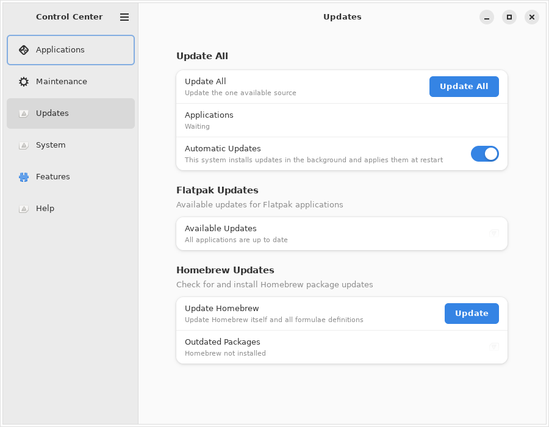
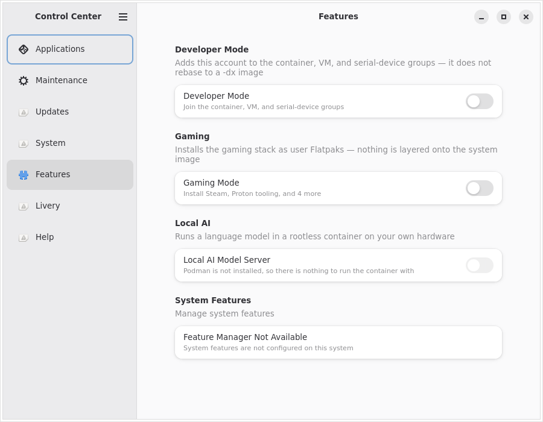
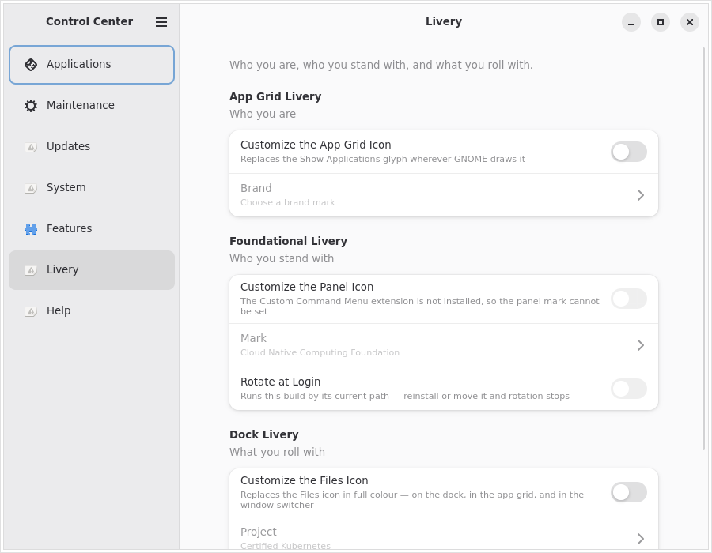
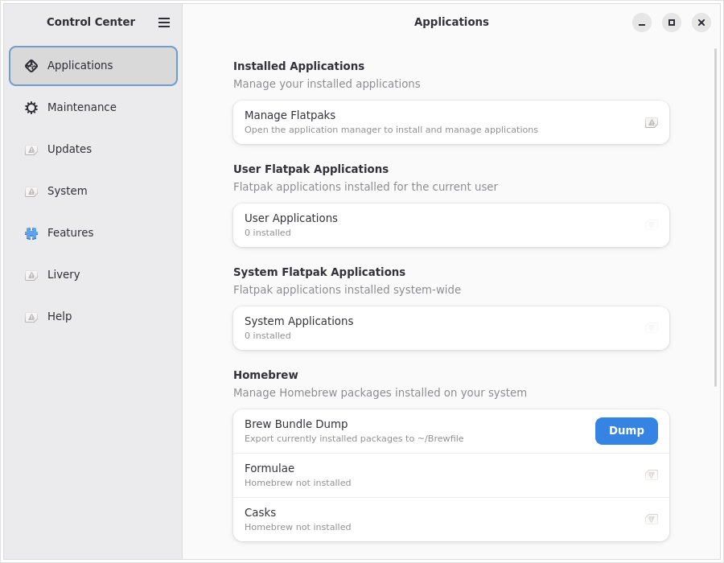
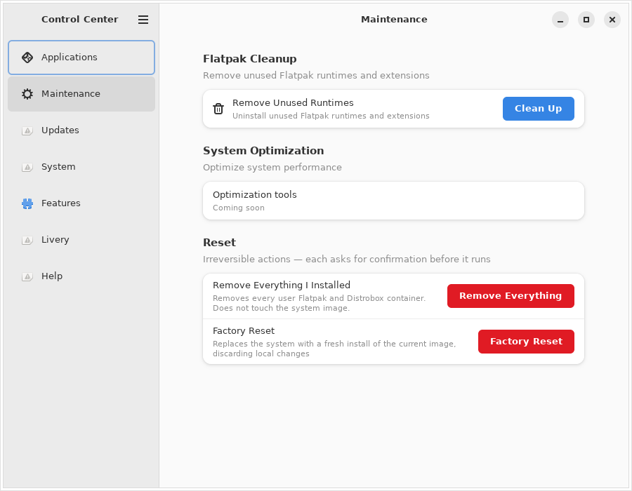
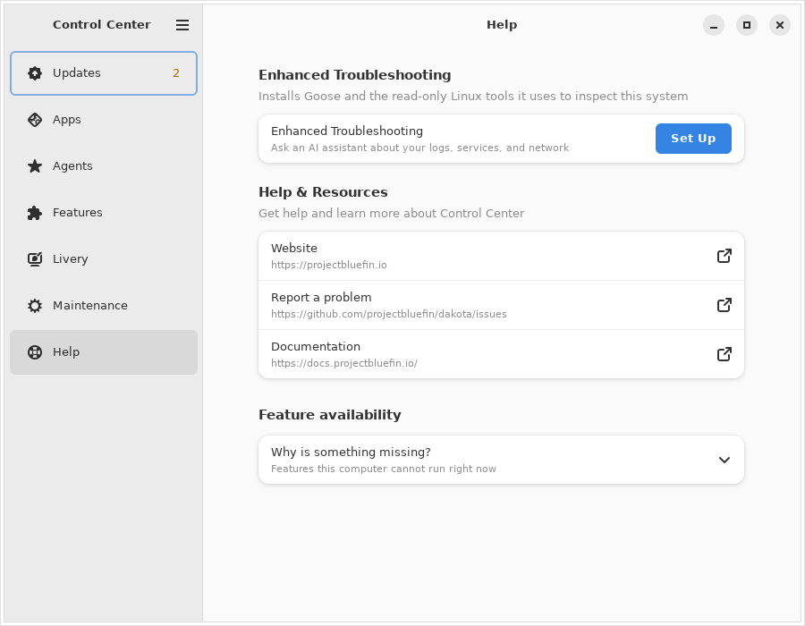

# Control Center walkthrough

Every screen in Control Center, captured from the real app by `make
screenshots` (see [below](#how-these-are-made)) — not mockups.

One app for Snow Linux and the Bluefin family (Bluefin, Bluefin LTS, Dakota).
Everything here is one control per decision — no strategy pickers, no
schedule choosers, no feature grids.

---

## Updates



**Update All** updates your system, your apps, and your packages in one
click, and tells you when it's done. It only asks you to restart if something
actually needs one. **Automatic Updates** keeps everything up to date in the
background. The Flatpak and Homebrew groups below let you update just one
thing if you prefer.

**System Updates** adds **What's Changing**, which lists exactly what software
a pending update will add, remove, or upgrade. That group only appears on
systems that update as a whole, so it's not in the shot above. **Roll Back** —
returning to the previous version if an update went badly — lives under
**Recovery**, and only appears where a previous deployment actually exists.

---

## System


Your system details. **System Image** — what's installed now, and what's
queued for the next restart — only appears on systems that update as a
whole, so it's not in the shot above. **Release Channel** switches between
the stable version and the early one. **Graphics Driver** switches you to
the NVIDIA driver if your card wants it. Neither appears unless there's
actually something to switch to. **Mission Center** opens the system
monitor. Under **Recovery** you can return to a previous system version or, if
you've opted in, reset this machine. It only shows when there's something to
return to or a reset is enabled.

## Recovery

Return to a previous system version, or reset this machine. This is not part
of routine maintenance: you open it deliberately from **System → Recovery**, and
routine Free Up Space never reaches it.

**Roll Back** returns you to the previous system deployment if an update went
badly — offered only when a previous deployment actually exists. **Previous
Version** shows the native A/B version you could return to, kept informational
unless a rollback is verified to work.

**Powerwash** removes everything you installed — your Flatpak apps and Distrobox
containers, not Homebrew or arbitrary software — and asks for confirmation
because it cannot be undone. **Factory Reset** puts the system back to how it
shipped, keeping its experimental warning and current-image-only target. Both
are switched off by default, so the rows stay hidden until you turn them on.

---

## Features



**Developer Mode** gives your account access to containers, virtual machines,
and serial devices. Switching it on also opens three tabs in your browser —
the Bluefin developer documentation, the Project Bluefin training catalog,
and the GNOME Developer Center — so the material you need next is already
open. Switching Developer Mode back off opens nothing.
**Gaming Mode** installs Steam and the tools that make
games run well. **Local AI** runs an AI model on your own machine instead of
in the cloud, using your graphics card if you have one — the first start
downloads several GB. **Enhanced Troubleshooting** sets up an AI assistant
that can read your logs, services, and network to help work out what's wrong,
then launches it — the row says which AI service answers your questions,
since the default one is Google's. It is only offered where Homebrew is
installed, so it's not in the shot above. **System Features** is Snow
Linux's feature manager, and is empty elsewhere.

---

## Livery



Who you are, who you stand with, and what you roll with.

**App Grid Livery** is your own mark on the Show Applications button. Search
all 3,461 brands [Simple Icons](https://simpleicons.org/) publishes — your
project, your employer, whatever you answer to — and Control Center fetches it
and nudges GNOME Shell to re-read its application icons so it appears straight
away — nothing is reloaded or rebuilt. You set it once; it never changes on its
own, because a personal mark that rotated would stop being personal.

**Foundational Livery** puts a foundation's mark in the top bar: CNCF, the
Linux Foundation, GNOME, freedesktop.org, Apache, Rust, Universal Blue,
Bazzite, Aurora, or the Open Gaming Collective. On a gaming image the
collective's mark is the one you start with, since that is whose work the
image ships — pick any other and it stays picked.

**Dock Livery** is the project you actually work on. Every CNCF project that
publishes artwork is in the list — 214 of them, Kubernetes through bootc — so
the picker searches rather than scrolls, and each one arrives as the project's
own colour icon straight from
[cncf/artwork](https://github.com/cncf/artwork).

Both can **Rotate at Login**, which moves one step down the list each time you
sign in — so you stand somewhere slightly different every day without ever
picking again.

Any section will also take an SVG of your own, which is the way in for
anything not on the list. A section pointed at your own file stops rotating —
rotation walks a catalogue, and your file is not in one — so the **Rotate at
Login** switch greys out and nothing overwrites your mark at the next sign-in.

Three things worth knowing. The top-bar section needs the Custom Command Menu
GNOME extension; without it the section says so and stays switched off rather
than offering a control that does nothing. The Files mark is the Files mark
everywhere — the dock, the app grid, the window switcher — because GNOME keeps
one icon per app, not one per place, and the app-grid glyph is shared the same
way. And only the Files icon is in colour: the top bar and the app grid draw
single-colour silhouettes, recoloured to match your theme, which is how every
other icon up there behaves.

Turning a section off puts back exactly what was there before, including a
mark your distribution set rather than one you chose.

---

## Applications



Your installed apps and Homebrew packages, search across both, **Bundles**
for installing a whole set at once, and a prompt before using an unofficial
Homebrew tap.

---

## Maintenance



Clean up files you no longer need, plus anything else your distribution added
here. The irreversible resets — Powerwash and Factory Reset — live under
**System → Recovery**, so they never appear in routine cleanup.

---

## Help



Links to the distribution's website, issues, and discussions.

---

## How these are made

```bash
make screenshots
```

Builds the app, runs it headless under Xvfb, and writes one cropped PNG per
page to `docs/screenshots/`. Always `--dry-run`, so nothing on the capture
machine changes. Hardware the runner doesn't have is stubbed, and `make ci`
checks no released binary can read those stubs.

Run it locally when something's appearance changes and you want to preview
before a release. It isn't regenerated per commit, since font and theme
drift would churn the repo — instead, `.github/workflows/release-screenshots.yml`
runs it automatically after each published GitHub Release (building from that
release's tag) and commits any changed PNGs to `main`, so what ships is what's
pictured here without anyone remembering to do it by hand. `make ci` checks
that every page and configurable group has a screenshot and an entry here.
